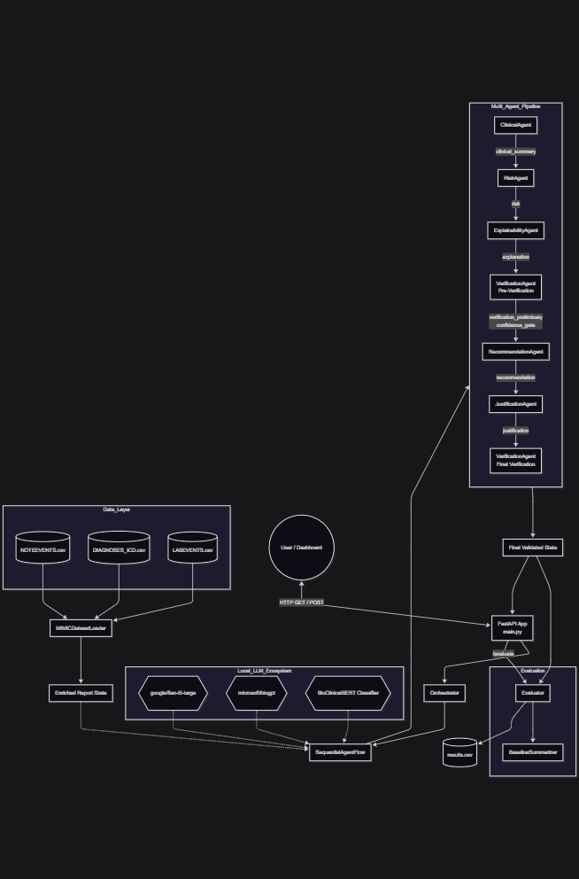

<div align="center">
  
  
  # 🏥 MedAI: Explainable Multi-Agent Framework for Patient-Centric Medical Report Comprehension
  
  **Transforming dense clinical discharge summaries into structured, safe-verified, patient-friendly explanations through a coordinated pipeline of specialized language agents.**
  
  [](https://www.python.org/)
  [](https://fastapi.tiangolo.com/)
  [](https://reactjs.org/)
  [](https://huggingface.co/)
  [](https://physionet.org/content/mimiciii/1.4/)
</div>

---

## 📖 Project Overview

Clinical Natural Language Processing (NLP) has traditionally struggled to bridge the communication gap between dense clinical documentation and patient understanding. Patients discharged from hospitals routinely receive documentation written at a post-graduate reading level, leading to poor medication adherence and follow-up compliance. 

**MedAI** directly addresses this deficiency through an automated, safety-verified, multi-agent generation pipeline. By combining **BioClinicalBERT** (for structured clinical representation) and **FLAN-T5-base** (for generative reasoning) in a structured multi-agent pipeline, the system automatically converts complex MIMIC-III clinical notes into patient-friendly explanations—complete with risk assessment, safe recommendations, and full clinical justification.

## ✨ Key Features & Capabilities

- 🧬 **Clinical NLP & Grounding:** Uses BioClinicalBERT fine-tuned on MIMIC-III discharge summaries for structured clinical fact extraction, ICD-9 enrichment, and 7-class disease classification.
- 🤖 **Multi-Agent Reasoning:** Leverages FLAN-T5 to power six specialized agents: Summarisation, Explainability, Risk Stratification, Recommendation, Justification, and Verification.
- 🛡️ **Safety-First Design (Zero Violations):** Every recommendation is filtered through strict *no-diagnose / no-prescribe* rules. A dedicated Two-Pass Verification Agent checks cross-agent consistency and applies Confidence-Gating.
- 📊 **Semantic Evaluation:** Evaluated on Flesch-Kincaid Grade Level (FKGL) readability improvement, BioClinicalBERT semantic QA cosine similarity, and Clinical Fact Consistency Rates.

## 🏗️ System Architecture

The system operates on a **Hybrid Clinical–Reasoning Multi-Agent Architecture** separating domain grounding from patient-centric reasoning.

1. **Clinical Extraction:** Enriches raw MIMIC-III records with ICD-9 diagnoses and lab events.
2. **Classification (BioClinicalBERT):** Assigns the note to one of seven disease categories, routing the semantic signal to the orchestrator.
3. **SequentialAgentFlow (FLAN-T5):** Coordinates the six purpose-built agents.
4. **Verification & Guardrails:** Ensures no unsafe clinical assertions reach the end user.

## 🚀 Performance Metrics

Evaluated on genuine MIMIC-III ICU discharge summaries, the multi-agent pipeline significantly outperforms a matched single-prompt FLAN-T5-base baseline:

- **Safety:** **0.0%** Unsafe Recommendation Rate (eliminating the 12.9% baseline violation rate).
- **Consistency:** **100%** Inter-agent clinical fact consistency.
- **Classification:** **0.852** Weighted-average F1 across 7 disease categories.
- **Information Preservation:** Retains **73.3%** of clinically relevant findings with a Semantic QA alignment score of **0.763**.

### FKGL Readability Improvement

The Explainability Agent successfully lowers the reading difficulty of discharge summaries from a post-graduate level to an upper-secondary reading level without compromising medical fidelity.

<div align="center">
  
  <br>
  <em>Figure: FKGL reading grade level reduction (mean Δ = -4.18 grade levels) across MIMIC-III discharge summaries. Lower values indicate greater accessibility.</em>
</div>

## 💻 Technology Stack

### Backend
- **Framework:** FastAPI, Uvicorn
- **AI/ML:** PyTorch, HuggingFace Transformers (`emilyalsentzer/Bio_ClinicalBERT`, `google/flan-t5-base`)
- **Data Processing:** Pandas, NumPy

### Frontend
- **Framework:** React.js, React Router
- **Visualization:** Recharts (Radar, Grouped Bar Charts)
- **Styling:** Vanilla CSS (Custom Design System, Dark/Light semantics)

## 🛠️ Local Setup & Installation

### 1. Prerequisites
- Python 3.12+
- Node.js & npm
- Local Hugging Face model cache (downloaded `google/flan-t5-base` and `emilyalsentzer/Bio_ClinicalBERT`)

### 2. Backend Setup
```powershell
# Clone the repository
git clone https://github.com/chiranjeevisegu/medical-system.git
cd medical-system

# Install Python dependencies
python -m pip install -r backend/requirements.txt

# Start the FastAPI server
uvicorn backend.api:app --reload --port 8000
```
*API Base URL:* `http://127.0.0.1:8000`  
*Swagger Docs:* `http://127.0.0.1:8000/docs`

### 3. Frontend Setup
```powershell
cd frontend

# Install Node modules
npm install

# Start the React development server
npm start
```
*Web App URL:* `http://localhost:3000`

---
*Disclaimer: This system provides informational support only and is not a substitute for professional medical advice, diagnosis, or treatment. Always seek guidance from a qualified healthcare provider.*
