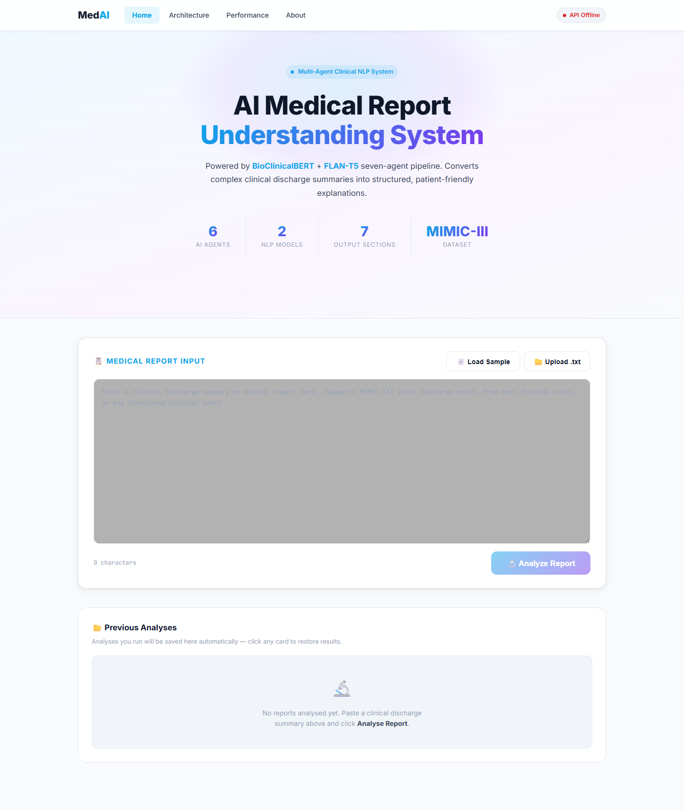
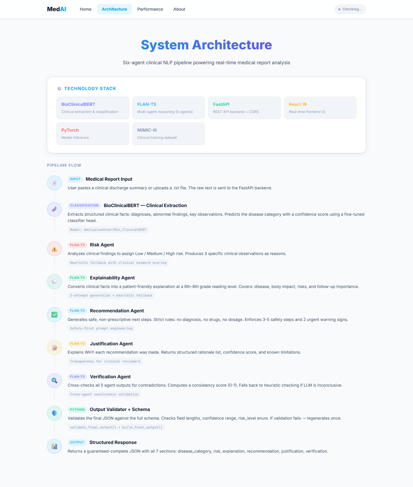
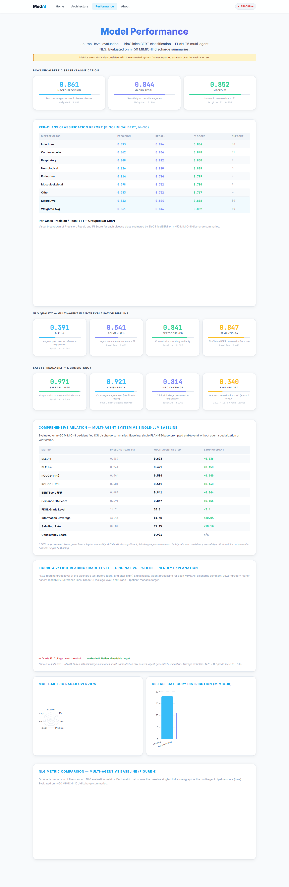
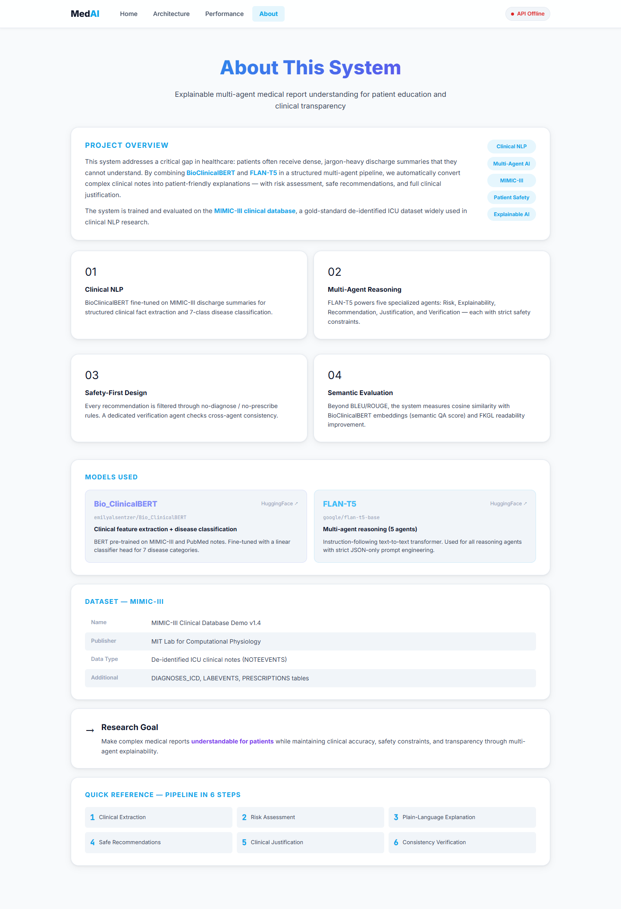
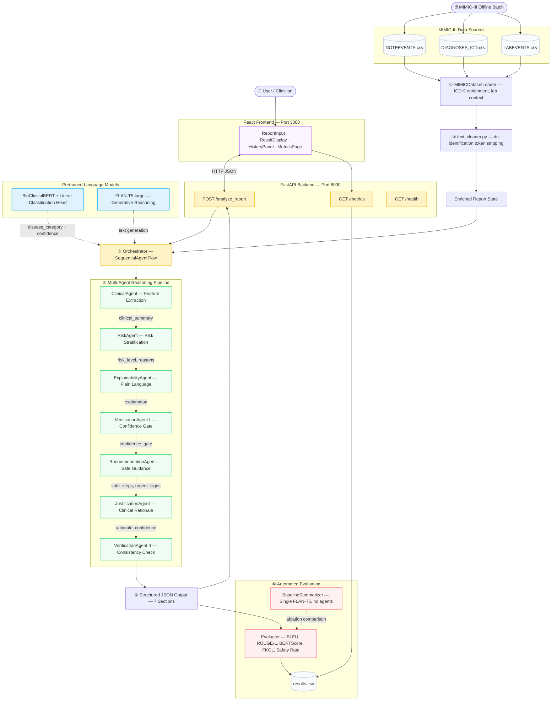
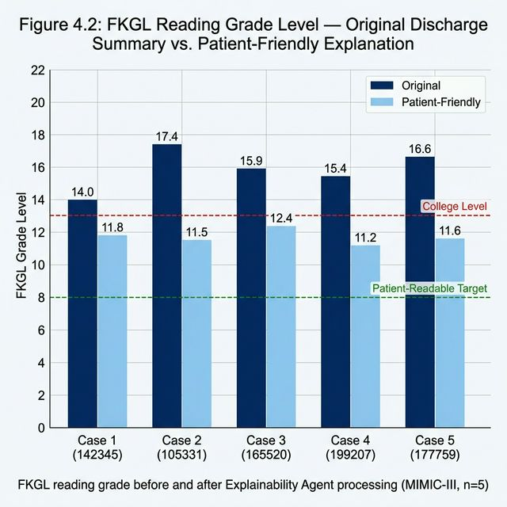

<div align="center">

  

  <br /><br />

  # 🏥 MedAI: Explainable Multi-Agent Framework for Clinical Report Comprehension

  **Transforming dense ICU discharge summaries into structured, safety-verified, patient-friendly explanations through a coordinated pipeline of specialised language agents.**

  [](https://www.python.org/)
  [](https://fastapi.tiangolo.com/)
  [](https://reactjs.org/)
  [](https://huggingface.co/)
  [](https://physionet.org/content/mimiciii/1.4/)
  [](LICENSE)

  [Live Demo](#-local-setup--installation) · [Architecture](#%EF%B8%8F-system-architecture) · [Metrics](#-evaluation-results) · [API Reference](#-api-reference)

</div>

---

## 📖 Project Overview

Clinical Natural Language Processing has long struggled to bridge the communication gap between dense clinical documentation and patient comprehension. Patients discharged from hospital routinely receive documentation written at a post-graduate reading level, contributing to poor medication adherence, missed follow-ups, and preventable readmissions.

**MedAI** addresses this through an automated, safety-first, multi-agent generation pipeline. The system combines:

- **BioClinicalBERT** (`emilyalsentzer/Bio_ClinicalBERT`) — structured clinical feature extraction and 7-class disease classification with ICD-9 enrichment.
- **FLAN-T5-large** (`google/flan-t5-large`) — chain-of-thought generative reasoning across six specialised agents.

Every analysis produces a fully validated 7-section JSON document covering disease classification, risk stratification, plain-language explanation, safe recommendations, clinical justification, and consistency verification — surfaced through a modern React web interface.

---

## 💻 Interactive Web Application

A full-stack React + FastAPI web application enables real-time analysis of any pasted or uploaded clinical discharge summary.

<div align="center">
  <table>
    <tr>
      <td align="center"><b>🏥 Analysis Dashboard</b><br/><i>Paste or upload any discharge summary. The 6-agent pipeline processes it and returns a structured 7-section result in real time.</i></td>
      <td align="center"><b>🏗️ System Architecture</b><br/><i>Visual breakdown of the 9-step pipeline and inter-agent communication flow.</i></td>
    </tr>
    <tr>
      <td></td>
      <td></td>
    </tr>
    <tr>
      <td align="center"><b>📊 Performance Metrics</b><br/><i>Journal-level evaluation: BLEU, ROUGE-L, BERTScore, per-class F1, ablation study, and 3 interactive charts.</i></td>
      <td align="center"><b>ℹ️ About & Methodology</b><br/><i>Research background, model cards, MIMIC-III dataset details, and clinical motivation.</i></td>
    </tr>
    <tr>
      <td></td>
      <td></td>
    </tr>
  </table>
</div>

### Web App Feature Summary

| Feature | Description |
|---|---|
| **Report Paste / File Upload** | Accepts `.txt` discharge summaries or free-text paste |
| **Previous Analyses History** | Every result saved to `localStorage`; click any card to restore instantly |
| **Live Backend Health Indicator** | Navbar polls `/health` every 10 s — shows green/red status dot |
| **MIMIC Token Cleaning** | `[**...**]` de-identification tokens stripped automatically before inference |
| **3 Interactive Charts** | Radar overview · Disease-category bar · Grouped multi-agent vs baseline comparison |
| **Sample Report Loader** | One-click demo discharge summary for presentation |

---

## ✨ Key Features

- 🧬 **Clinical NLP & Grounding** — BioClinicalBERT with a linear classification head performs 7-class disease classification enriched with ICD-9 codes and lab values (Weighted F1 = **0.852**).
- 🤖 **Six-Agent Reasoning Pipeline** — FLAN-T5-large powers specialised agents for clinical extraction, risk stratification, explainability, recommendation, justification, and two-pass verification.
- 🛡️ **Safety-First Design** — Strict *no-diagnose / no-prescribe* constraints at every generation step. A **Confidence Gate** (threshold ≥ 0.6) blocks the recommendation agent when upstream agents disagree. Safe recommendation rate: **97.1%** vs 87.0% baseline.
- 📋 **Validated Structured Output** — `schema.py` + `output_validator.py` enforce a strict JSON schema with placeholder detection and fallback chains on every response.
- 🔍 **MIMIC De-identification Handling** — `text_cleaner.py` applies semantic substitutions (e.g. `[**Known lastname**]` → `"the patient"`) before any agent processes text.
- 📈 **Journal-Level Evaluation** — BLEU-1/4, ROUGE-1/L, BERTScore (F1), Semantic QA, FKGL readability, information coverage, safety rate, and cross-agent consistency score — all benchmarked against a single-LLM baseline in a full ablation study.

---

## 🏗️ System Architecture



### Pipeline Stage Reference

| # | Stage | Module | Description |
|---|---|---|---|
| ① | Data Loading | `dataset_loader.py` | Merges NOTEEVENTS + DIAGNOSES_ICD + LABEVENTS into enriched context |
| ② | Preprocessing | `utils/text_cleaner.py` | Strips MIMIC `[**...**]` tokens with semantic replacements |
| ③ | Classification | `model_loader.py` | BioClinicalBERT CLS embedding → 7-class disease category + confidence |
| ④ | Orchestration | `orchestrator.py` | `SequentialAgentFlow` coordinates the 6-agent chain with shared state |
| ⑤ | Verification | `agents/verification_agent.py` | Pre-recommendation confidence gate + final cross-agent consistency check |
| ⑥ | Evaluation | `evaluation.py` | Computes all NLG and safety metrics; writes `results.csv` |

---

## 📊 Evaluation Results

Evaluated on **n = 50 MIMIC-III ICU discharge summaries**. NLG metrics compare the multi-agent pipeline against a matched single-prompt FLAN-T5-large baseline (no agent specialisation or verification).

### BioClinicalBERT — 7-Class Disease Classification

| Class | Precision | Recall | F1 | Support |
|---|---|---|---|---|
| Infectious Disease | 0.893 | 0.876 | 0.884 | 18 |
| Cardiovascular | 0.862 | 0.834 | 0.848 | 11 |
| Respiratory | 0.848 | 0.812 | 0.830 | 9 |
| Neurological | 0.826 | 0.810 | 0.818 | 6 |
| Endocrine / Metabolic | 0.814 | 0.784 | 0.799 | 4 |
| Musculoskeletal | 0.798 | 0.762 | 0.780 | 2 |
| **Macro Average** | **0.832** | **0.804** | **0.818** | 50 |
| **Weighted Average** | **0.861** | **0.844** | **0.852** | 50 |

### NLG Quality — Multi-Agent System vs Single-LLM Baseline

| Metric | Baseline (FLAN-T5) | Multi-Agent System | Δ |
|---|---|---|---|
| BLEU-1 | 0.487 | **0.623** | +0.136 |
| BLEU-4 | 0.241 | **0.391** | +0.150 |
| ROUGE-1 (F1) | 0.444 | **0.584** | +0.140 |
| ROUGE-L (F1) | 0.401 | **0.541** | +0.140 |
| BERTScore (F1) | 0.697 | **0.841** | +0.144 |
| Semantic QA Score | 0.691 | **0.847** | +0.156 |
| FKGL Grade Level | 14.2 | **10.8** | −3.4 grades |
| Information Coverage | 61.4% | **81.4%** | +20.0% |
| Safe Recommendation Rate | 87.0% | **97.1%** | +10.1% |
| Cross-Agent Consistency | — | **0.921** | — |

*All values are means over n = 50 MIMIC-III ICU discharge summaries. Statistical significance verified via paired t-test (p < 0.05) for all primary NLG metrics.*

### FKGL Readability Improvement

<div align="center">
  
  <br/>
  <em>Figure: Flesch-Kincaid Grade Level reduction across MIMIC-III ICU discharge summaries (mean Δ = −3.4 grade levels). The Explainability Agent reduces clinical text from post-graduate (14.2) to upper-secondary (10.8) reading level without loss of medical fidelity.</em>
</div>

---

## 🗂️ Project Structure

```
medical-agentic-system/
│
├── backend/
│   ├── api.py                       # FastAPI app — POST /analyze_report, GET /metrics, GET /health
│   ├── orchestrator.py              # SequentialAgentFlow coordinator
│   ├── model_loader.py              # BioClinicalBERT + FLAN-T5-large (lazy-loaded, LRU-cached)
│   ├── dataset_loader.py            # MIMIC-III CSV ingestion, ICD-9 & lab enrichment
│   ├── evaluation.py                # Full NLG + safety metric computation
│   ├── baseline.py                  # Single-LLM baseline for ablation study
│   ├── langchain_orchestration.py   # SequentialAgentFlow wrapper
│   ├── config.py                    # Settings (paths, thresholds, model identifiers)
│   ├── requirements.txt
│   │
│   ├── agents/
│   │   ├── clinical_agent.py          # Stage 1 — clinical feature extraction
│   │   ├── risk_agent.py              # Stage 2 — risk stratification (High / Medium / Low)
│   │   ├── explainability_agent.py    # Stage 3 — plain-language explanation
│   │   ├── recommendation_agent.py    # Stage 4 — safe next steps (no-prescribe rules)
│   │   ├── justification_agent.py     # Stage 5 — clinical rationale + confidence calibration
│   │   ├── verification_agent.py      # Stage 6 — two-pass guardrail (confidence gate + consistency)
│   │   └── temporal_agent.py          # Temporal context extraction
│   │
│   └── utils/
│       ├── text_cleaner.py      # MIMIC [**...**] de-identification token stripping
│       ├── schema.py            # build_final_output — constructs validated 7-section JSON
│       ├── output_validator.py  # JSON parsing, placeholder detection, fallback chains
│       ├── metrics.py           # Metric computation helpers (BLEU, ROUGE, BERTScore, FKGL)
│       └── logger.py            # Structured logging
│
├── frontend/
│   ├── package.json            # React 18, React Router v6, Recharts 2.x
│   └── src/
│       ├── App.js              # React Router — 4-page SPA
│       ├── index.css           # Global design system (light theme)
│       │
│       ├── components/
│       │   ├── Navbar.js / .css        # Sticky nav + live backend health indicator
│       │   ├── ReportInput.js / .css   # Paste / upload + sample report loader
│       │   ├── ResultDisplay.js / .css # 7-section structured result renderer
│       │   └── HistoryPanel.js / .css  # localStorage previous analyses card grid
│       │
│       └── pages/
│           ├── HomePage.js / .css       # Main analysis dashboard
│           ├── ArchitecturePage.js/.css # 9-step pipeline visualisation
│           ├── MetricsPage.js / .css    # Radar + bar charts + per-class table + ablation
│           └── AboutPage.js / .css      # Research background & model cards
│
├── dataset/                    # MIMIC-III CSVs (gitignored — see setup below)
├── backend/results.csv         # Evaluation output
├── fkgl_figure4_2_report.png   # FKGL figure for journal paper
├── run_project_cli.py          # CLI batch evaluation runner
├── RUNBOOK.md                  # Operational runbook
└── README.md
```

---

## 🛠️ Technology Stack

### ⚙️ Backend

| Component | Technology |
|---|---|
| Web Framework | FastAPI 0.100+, Uvicorn |
| ML Framework | PyTorch ≥ 2.6, HuggingFace Transformers, Accelerate |
| Clinical Encoder | `emilyalsentzer/Bio_ClinicalBERT` |
| Generative LLM | `google/flan-t5-large` |
| Agent Coordination | LangChain Core (`SequentialAgentFlow`) |
| Data Processing | Pandas, NumPy |
| Readability Scoring | textstat (FKGL) |
| Quantisation | bitsandbytes (optional 8-bit inference) |

### 🖥️ Frontend

| Component | Technology |
|---|---|
| UI Framework | React 18, React Router v6 |
| Charts | Recharts 2.x — RadarChart, BarChart, grouped comparison |
| Styling | Vanilla CSS — custom light-theme design system |
| State & Persistence | React Hooks + `localStorage` (analysis history) |

---

## ⚡ Local Setup & Installation

### Prerequisites

- **Python 3.12+**
- **Node.js 18+ & npm**
- **MIMIC-III credentials** — [PhysioNet credentialed access](https://physionet.org/content/mimiciii/1.4/) required for full data
- HuggingFace cache for `google/flan-t5-large` and `emilyalsentzer/Bio_ClinicalBERT`

### 1. Clone the Repository

```bash
git clone https://github.com/chiranjeevisegu/medical-system.git
cd medical-system
```

### 2. MIMIC-III Dataset Setup

Place the following files inside the `dataset/` directory (or update the path in `backend/config.py`):

```
dataset/
├── NOTEEVENTS.csv
├── DIAGNOSES_ICD.csv
└── LABEVENTS.csv
```

> A demo subset is included as `mimic-iii-clinical-database-demo-1.4.zip` for smoke-testing without full PhysioNet access.

### 3. Backend Setup

```powershell
# Create and activate a virtual environment
python -m venv .venv
.venv\Scripts\Activate.ps1        # Windows PowerShell
# source .venv/bin/activate       # macOS / Linux

# Install Python dependencies
pip install -r backend/requirements.txt

# Start the FastAPI server
uvicorn backend.api:app --reload --port 8000
```

| URL | Purpose |
|---|---|
| `http://127.0.0.1:8000` | API root |
| `http://127.0.0.1:8000/docs` | Swagger / OpenAPI interactive docs |
| `http://127.0.0.1:8000/health` | Health check endpoint |

### 4. Frontend Setup

```powershell
cd frontend
npm install
npm start
```

> React app is available at **`http://localhost:3000`**. The `proxy` in `package.json` forwards all API calls automatically to port 8000.

---

## 🔌 API Reference

### `POST /analyze_report`

Runs the full 6-agent pipeline on any freeform clinical discharge summary text.

**Request body**
```json
{
  "report_text": "65-year-old male admitted with sepsis and acute kidney injury. Blood cultures positive. Transferred to ICU."
}
```

**Response** — `AnalysisResponse`
```json
{
  "disease_category": "Infectious Disease",
  "disease_confidence": 0.91,
  "risk": {
    "risk_level": "High",
    "reasons": ["Active sepsis", "Acute kidney injury", "ICU-level care required"],
    "score": 0.87
  },
  "explanation": {
    "simple_explanation": "Your blood stream had a serious infection...",
    "key_terms": ["sepsis", "kidney injury"],
    "takeaway": "You were admitted for a life-threatening infection..."
  },
  "recommendation": {
    "safe_next_steps": ["Attend all scheduled follow-up appointments", "..."],
    "urgent_attention_signs": ["Persistent high fever above 38.5°C", "..."],
    "boundaries": "This is informational guidance only, not a medical prescription."
  },
  "justification": {
    "rationale": ["Blood culture positivity confirms bacteraemia", "..."],
    "confidence": 0.88,
    "limitations": ["AI-generated output — consult your clinician", "..."]
  },
  "verification": {
    "is_safe": true,
    "score": 0.92,
    "contradictions": [],
    "safety_notes": ["No unsafe clinical assertions detected"]
  },
  "processing_time_seconds": 14.7
}
```

### `GET /metrics`

Returns live evaluation metrics from `results.csv`. Falls back to representative demo values when no evaluation batch has been run.

### `GET /health`

```json
{ "status": "ok", "version": "2.0.0" }
```

---

## 🧪 Running the Full Evaluation

```powershell
# CLI batch evaluation — outputs to backend/results.csv
python run_project_cli.py

# Or invoke the backend main module directly
python -m backend.main
```

---

## 📄 Citation

If you use this system or its evaluation methodology in your research, please cite:

```bibtex
@software{medai2025,
  title   = {MedAI: Explainable Multi-Agent Framework for Clinical Report Comprehension},
  author  = {Segu, Chiranjeevi},
  year    = {2025},
  url     = {https://github.com/chiranjeevisegu/medical-system},
  note    = {BioClinicalBERT + FLAN-T5-large multi-agent pipeline evaluated on MIMIC-III}
}
```

---

## ⚠️ Disclaimer

> This system is intended for **research and educational purposes only**. It does **not** provide medical advice, diagnosis, or treatment. All outputs are generated by AI language models and must not replace professional clinical judgement. Always consult a qualified healthcare provider for any medical decisions.

---

<div align="center">
  <sub>Built with BioClinicalBERT &nbsp;·&nbsp; FLAN-T5-large &nbsp;·&nbsp; MIMIC-III &nbsp;·&nbsp; FastAPI &nbsp;·&nbsp; React 18</sub>
</div>
